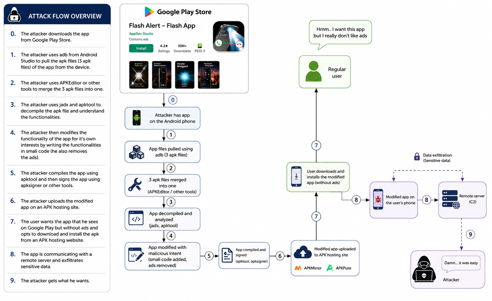
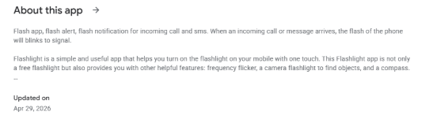

# Shadow APK - Security of Mobile Devices assignment 3 project

Team members:  
- Horia Alexandru Banica
- Dragos Marius Banica

# Project overview

The target app was chosen to be one that already has implemented and uses multiple permissions (camera, contacts access, reading messages and more) and we want to exploit those permissions to see what we can achieve. So we’ve found this app named Flash Alert - Flash App on Google Play that has over 50 million downloads. Here you can see the description from Google Play Store:

