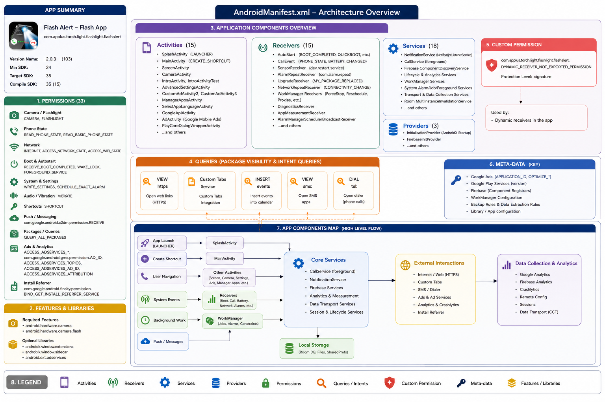
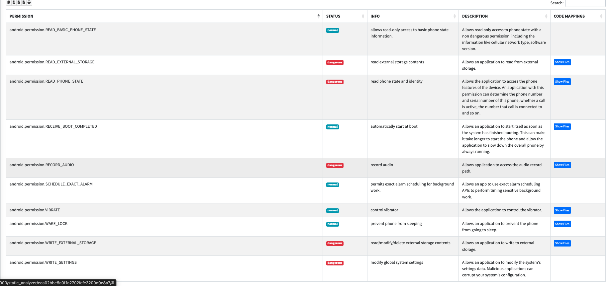

# Shadow APK - Security of Mobile Devices assignment 3 project

Team members:  
- Horia Alexandru Banica
- Dragos Marius Banica

# Description 

Our project is meant to simulate and recreate what an attacker can do with a normal app from Google Play Store and how he can transform a regular basic app into a Trojan.

# DISCLAIMER
This project is provided strictly for educational, research, and reverse-engineering purposes only.
All testing was performed in a local controlled environment on devices owned by us (the researchers).
We do not encourage, support, or condone unauthorized access, surveillance, data collection, or misuse of Android applications or devices.
Use this code responsibly and only in environments where you have explicit permission.

# Project overview

The target app was chosen to be one that already has implemented and uses multiple permissions (camera, contacts access, reading messages and more) and we want to exploit those permissions to see what we can achieve. So we’ve found this app named Flash Alert - Flash App on Google Play that has over 50 million downloads. Here you can see the description from Google Play Store:

Looking at the AndroidManifest.xml file you can see that it has a lot of components but our main goal was to make custom Activities that replace the current ones while maintaining the functionalities as much as possible.

These are the tools used:

- jadx/jadx-gui
- Android Studio
- adb
- APKEditor
- apktool
- apksigner 

# Features that we implemented

- Notification capture via NotificationListenerService (package, title, message)
- Local JSON log storage of the notifications 
- Camera captures via AutoCaptureActivity that imitates the behavior of CameraActivity 
- Local storage and deletion of camera images
- Communication with a remote server via AnalyticsBeacon that sends notification logs and camera captures

For the remote server we created the backend functionality which you can see in server.py file and hosted it on Google Cloud. This is how to start the server:  
uvicorn server:app --host 0.0.0.0 --port 8080

# Static analysis 

We analyzed the modified apk with mobsf and there are certain things that give it away as malware:  
1. the suspicious permissions the app uses, to make it harder to detect we would need to reduce the required permissions  
2. the hardcoded urls in text -> to make it harder to detect we should obfuscate the strings that make up the request URL and only create it at runtime to avoid static analysis detection  
3. the fact that http requests are allowed -> setup our backend server to have an https certificate...  

